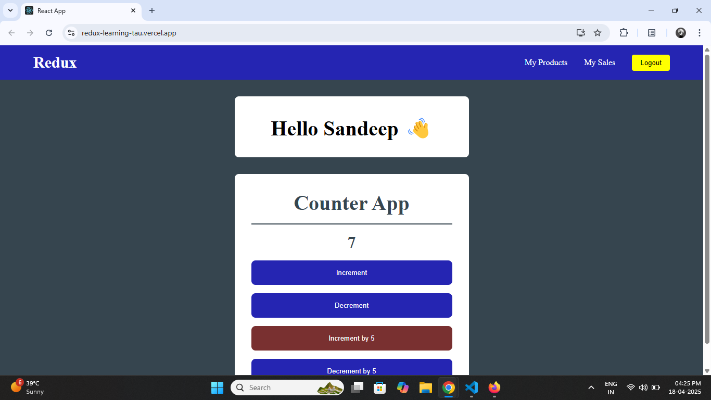

# 🧠 Redux Learning Project

This project is built to help understand the fundamentals of **Redux Toolkit** in a React application. It includes basic features like user authentication and a counter, showing how to manage global state effectively with modern Redux practices.

---

## 📖 What I Learned

✅ How to set up Redux Toolkit  
✅ Creating slices with actions and reducers  
✅ Connecting store to React using `<Provider>`  
✅ Reading state with `useSelector`  
✅ Dispatching actions with `useDispatch`  
✅ Structuring app logic cleanly into components  

The app basically checks if a user is "logged in" (mocked).  
If yes → shows profile + counter.  
If no → shows login screen.

---

## 🔥 Quick Guide: Redux Toolkit Setup in React

### 1. Install Redux Toolkit and React-Redux

```bash
npm install @reduxjs/toolkit react-redux
```

### 2. Create a Slice

```js
import { createSlice } from "@reduxjs/toolkit";

const slice = createSlice({
  name: "yourSliceName",
  initialState: {},
  reducers: {
    yourAction(state, action) {
      // update state here
    },
  },
});

export const yourActions = slice.actions;
export default slice.reducer;
```

### 3. Configure the Store

```js
import { configureStore } from "@reduxjs/toolkit";
import yourReducer from "./yourSlice";

const store = configureStore({
  reducer: { yourKey: yourReducer },
});

export default store;
```

### 4. Wrap App with Provider

```js
import { Provider } from "react-redux";
import store from "./store";

<Provider store={store}>
  <App />
</Provider>
```

### 5. Use Redux in Components

```js
import { useSelector, useDispatch } from "react-redux";
import { yourActions } from "./yourSlice";

const Component = () => {
  const data = useSelector(state => state.yourKey.someData);
  const dispatch = useDispatch();

  return (
    <>
      <button onClick={() => dispatch(yourActions.yourAction())}>Click</button>
    </>
  );
};
```

## Preview


